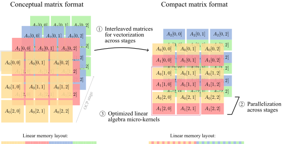

<p align="center"></p>

# batmat

Fast linear algebra routines for batches of small matrices.

Batmat is used as the linear algebra backend for the [Cyqlone](https://github.com/kul-optec/cyqlone) solver,
where it is used to perform vectorized operations across multiple stages in an optimal control problem.

To enable vectorization, batmat stores batches of small matrices in an interleaved “compact” format in memory, where the corresponding elements of all matrices in a batch are stored together, as shown in the figure below (for a batch size of two).
Custom linear algebra routines then operate on all matrices in a batch simultaneously using SIMD instructions. These routines are built on top of highly optimized micro-kernels.

<p align="center">
<picture>
  <source media="(prefers-color-scheme: dark)" srcset="docs/interleaved-dark.svg">
  <source media="(prefers-color-scheme: light)" srcset="docs/interleaved-light.svg">
  
</picture>
</p>

## Supported routines

| Routine                        | Operation                                        | Notes                                                                    |
|-------------------------------:|:-------------------------------------------------|:-------------------------------------------------------------------------|
| `gemm(A, B, D)`                | $D_i = A_i B_i$                                  |                                                                          |
| `gemm_neg(A, B, D)`            | $D_i = -A_i B_i$                                 |                                                                          |
| `gemm_add(A, B, C, D)`         | $D_i = C_i + A_i B_i$                            |                                                                          |
| `gemm_sub(A, B, C, D)`         | $D_i = C_i - A_i B_i$                            |                                                                          |
| `syrk(A, D)`                   | $D_i = A_i A_i^\top$                             | $D_i$ symmetric                                                          |
| `syrk_neg(A, D)`               | $D_i = -A_i A_i^\top$                            | $D_i$ symmetric                                                          |
| `syrk_add(A, C, D)`            | $D_i = C_i + A_i A_i^\top$                       | $C_i, D_i$ symmetric                                                     |
| `syrk_sub(A, C, D)`            | $D_i = C_i - A_i A_i^\top$                       | $C_i, D_i$ symmetric                                                     |
| `trmm(A, B, D)`                | $D_i = A_i B_i$                                  | $A_i$ and/or $B_i$ triangular                                            |
| `trmm_neg(A, B, D)`            | $D_i = -A_i B_i$                                 | $A_i$ and/or $B_i$ triangular                                            |
| `trmm_add(A, B, C, D)`         | $D_i = C_i + A_i B_i$                            | $A_i$ and/or $B_i$ triangular                                            |
| `trmm_sub(A, B, C, D)`         | $D_i = C_i - A_i B_i$                            | $A_i$ and/or $B_i$ triangular                                            |
| `potrf(C, D)`                  | $D_i = \mathrm{chol}(C_i)$                       | $C_i$ symmetric positive definite, $D_i$ lower triangular                |
| `syrk_add_potrf(A, C, D)`      | $D_i = \mathrm{chol}(C_i + A_i A_i^\top)$        | $C_i + A_i A_i^\top$ symmetric positive definite, $D_i$ lower triangular |
| `syrk_sub_potrf(A, C, D)`      | $D_i = \mathrm{chol}(C_i - A_i A_i^\top)$        | $C_i - A_i A_i^\top$ symmetric positive definite, $D_i$ lower triangular |
| `trsm(A, B, D)`                | $D_i = A_i^{-1} B_i$ or $D_i = A_i B_i^{-1}$     | $A_i$ or $B_i$ triangular                                                |
| `trtri(A, D)`                  | $D_i = A_i^{-1}$                                 | $A_i$ triangular                                                         |
| `gemm_diag(A, B, D, d)`        | $D_i = A_i \mathrm{diag}(d_i) B_i$               |                                                                          |
| `gemm_diag_add(A, B, C, D, d)` | $D_i = C_i + A_i \mathrm{diag}(d_i) B_i$         |                                                                          |
| `syrk_diag_add(A, C, D, d)`    | $D_i = C_i + A_i \mathrm{diag}(d_i) A_i^\top$    | $C_i, D_i$ symmetric                                                     |
| `symm_add(A, B, C, D)`         | $D_i = C_i + A_i B_i$                            | $A_i$ symmetric                                                          |
| `copy(A, B)`                   | $B_i = A_i$                                      |                                                                          |
| `fill(a, B)`                   | $B_i = \mathrm{broadcast}(a)$                    |                                                                          |

A selection of these routines also support masking, shifting, or rotating the arguments (for example, $D_{i+1} = C_i + A_i B_i$).

## Example usage

```cpp
#include <batmat/linalg/copy.hpp>
#include <batmat/linalg/gemm.hpp>
#include <batmat/linalg/potrf.hpp>
#include <batmat/matrix/matrix.hpp>
#include <guanaqo/print.hpp>
#include <algorithm>
#include <cmath>
#include <iostream>
#include <limits>
#include <random>

using batmat::index_t;
using batmat::real_t;
namespace la = batmat::linalg;

int main() {
    using batch_size             = std::integral_constant<index_t, 4>;
    constexpr auto storage_order = batmat::matrix::StorageOrder::ColMajor;
    // Class representing a batch of four matrices.
    using Mat = batmat::matrix::Matrix<real_t, index_t, batch_size, batch_size, storage_order>;
    // Allocate some batches of matrices (initialized to zero).
    index_t n = 3, m = n + 5;
    Mat C{{.rows = n, .cols = n}}, A{{.rows = n, .cols = m}};
    // Fill A with random values.
    std::mt19937 rng{12345};
    std::uniform_real_distribution<real_t> uni{-1.0, 1.0};
    std::ranges::generate(A, [&] { return uni(rng); });
    // Compute C = AAᵀ to make it symmetric positive definite (lower triangular part only).
    la::syrk(A, la::tril(C));
    // Allocate L for the Cholesky factors.
    Mat L{{.rows = n, .cols = n}, batmat::matrix::uninitialized};
    // Compute the Cholesky factors L of C (lower triangular).
    la::fill(0, la::triu(L));
    la::potrf(la::tril(C), la::tril(L));
    // Print the results.
    for (index_t l = 0; l < C.depth(); ++l) {
        guanaqo::print_python(std::cout << "C[" << l << "] =\n", C(l));
        guanaqo::print_python(std::cout << "L[" << l << "] =\n", L(l));
    }
    // Compute LLᵀ (in-place).
    la::syrk(la::tril(L));
    // Check that LLᵀ == C.
    int errors     = 0;
    const auto eps = std::numeric_limits<real_t>::epsilon();
    for (index_t l = 0; l < C.depth(); ++l)
        for (index_t c = 0; c < C.cols(); ++c)
            for (index_t r = c; r < C.rows(); ++r)
                errors += std::abs(C(l, r, c) - L(l, r, c)) < 10 * eps ? 0 : 1;
    return errors;
}
```

## Installation

**Dependencies:** [guanaqo](https://github.com/tttapa/guanaqo)

Batmat can be installed using the standard CMake workflow.
To install the necessary dependencies, it is recommended to use the [Conan](https://conan.io/) package manager:
```sh
git clone https://github.com/tttapa/conan-recipes.git
conan remote add tttapa-conan-recipes "$PWD/conan-recipes"
conan install . --build=missing
cmake --fresh --preset conan-release
cmake --build --preset conan-release
```

> [!TIP]
> Batmat makes extensive use of vectorization (in fact, that's kind of the whole point).
> Be sure to enable SIMD ISA extension support in your Conan profile's
> compiler flags for the best performance.
> See [scripts/dev/profiles/laptop](scripts/dev/profiles/laptop) for an example.

## Benchmarks

Batmat performs exceptionally well on matrices smaller than around 100×100 (that fit in the L2 cache), where it outperforms traditional scalar linear algebra libraries such as Intel MKL, OpenBLAS, and BLASFEO (especially for triangular or symmetric matrices).

```sh
. ~/intel/oneapi/setvars.sh  # For the Intel MKL
python3 -m pip install -r benchmarks/scripts/requirements.txt
conan install . --build=missing -o guanaqo/\*:with_mkl=True -o\&:with_benchmarks=True -o\&:with_blasfeo=True
cmake --fresh --preset conan-release -DBATMAT_WITH_ACCURATE_BUILD_TIME=Off
cmake --build --preset conan-release -t viz-benchmark-potrf  # or gemm, syrk, trsm, syrk-potrf, trmm, trtri, hyh
```
